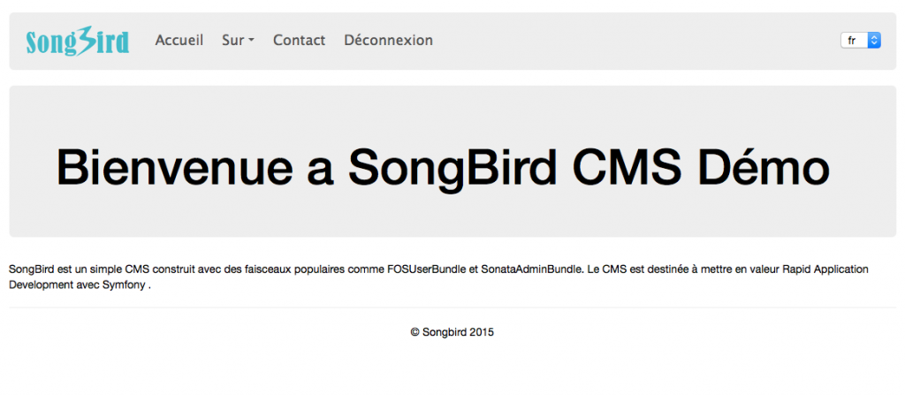

# SongBird 

**This book is still work in progress to update to Symfony 3.1... The cms is completed but I am polishing the content and workflow. If you want to see the final product, simply checkout chapter_20. See [changelog](CHANGELOG.md) for updates. Any comments welcomed.**



This is an online book and repository documenting the creation of SongBird, a simple CMS created using Symfony.

I created this project to:

* Illustrate the power of rapid development with Symfony.

* Reduce the learning curve by sharing step-by-step guide to create a simple CMS. This process should be helpful to anyone who wants to dive into Symfony.

* Kickstart more complex Symfony projects with this application.

* Have fun! 

## Suggestions and Improvements

Feel free to create pull request if you spot any typos or problems with the code. The better this project can help the community, the better it is.

## License

Book License: [CC BY-SA 3.0 License](http://creativecommons.org/licenses/by-sa/3.0/)

Code License: [MIT](https://opensource.org/licenses/MIT)

## Introduction


Building an application is like building a Pyramid. You create each piece of functionality bit by bit. You test the functionality and make sure its stable before building the next piece. This cycle continues until you reach the peak - completion.

Choosing the best framework for RAD (Rapid Application Development) has been a topic that has been debated to death. Today, there is no longer such a thing as "The Best Framework" because all modern day frameworks follow the best practice. However, there is such a thing called "The Best Practice". In fact, you could see similar develoment methodologies being used across all frameworks. So knowing one framework well means you can jump between other frameworks easily. Just as human evolves, different frameworks learn from each other and adapt very fast to new and better ways of doing things.

At the time of writing, NodeJS and Rails continue to innovate with PHP closing in fast behind. PHP is the old veteran when comes to web development with the most frameworks in the market. The 2 frameworks that stand out from the pack at the time of writing were Laravel and Symfony. If you are looking to learn a new framework, I highly recommend Symfony because it is one of the more stable modern framework out there. Symfony components have been used by many projects including Drupal and Laravel.

Symfony 2 is a mature framework. A mature framework means that information and libraries don’t get outdated quickly. Adapting too fast to technology is not a good thing because 3rd party libraries couldn’t catch up. Rails early days suffered from this. Nothing worked out of the box and googled information was often outdated. Unless you enjoy spending time troubleshooting system configurations and library dependencies, choose a stable framework that is well supported and documented. You should be spending your precious time learning the software instead.

Learning a new framework has never been an easy task. Many people follow tutorials in google and read up all the documentation in [Symfony website](http://symfony.com) and still find it challenging to create a simple application. Why? Because there is just too much theory and not enough real world practical examples. Worst still, you can get entangled in technical jargons and advance customisations easily. The fact that Symfony is an extremely flexible framework makes it even harder to master because there are so many ways to achieve the same goal. If you are new to MVC (Model-View-Controller) and RAD, you will find that Symfony has a steep learning curve.

This book aims to lower the learning curve by providing a step by step hands-on approach to guide developers who are new to Symfony to build a simple CMS (Let us call it "SongBird") using good industry practice. Hopefully after following all the chapters, your eyes will be opened to RAD and the unlimited possibilities with Symfony. 

## About Me

I am currently the Lead Developer at a digital agency in Melbourne, Australia. I am a thinker, innovator, coder, open source enthusiast and raspberry pi lover. Over the years, I have lead and/or developed software for Telstra, BP, Defence Force, BUPA, ANZ bank and many big brands using various frameworks including Symfony. Symfony has a special place in my heart due to the beauty of its architecture and stability. 

I am passionate about technologies and innovation... and is not a typical coder who sits in front of the computer 24/7. I love experimenting, sharing and talking to people and keeping myself busy.

## Audience

This book is targeted at developers who are new to Symfony. If you are already an seasoned PHP Developer, I hope you would pick up some hints here and there.

## Why Re-invent the Wheel?

At the time of writing, there are already many CMS and a few popular Symfony ones out there. Symfony has the [cmf project](http://cmf.symfony.com/). Why built a new one? 

We are not building a new CMS and SongBird is not trying to compete in the CMS space. SongBird exists to demonstrate the best practices in web development with Symfony and provide practical tutorials for people who want to try out Rapid Development with a modern day framework.

## Is SongBird Reusable?

Definitely. SongBird is not just a tutorial project, I use it often as a vanilla framework to kickstart projects. Its a hugh time saver because all common features have been build and configured already. Since I built the software, I have full knowledge of how the software works and know where to customise things should the need arises. 

You can also think of SongBird as a foundation to learn [cmf project](http://cmf.symfony.com/). Once you are comfortable with the basic concepts of building a CMS, you are ready for more complex projects.

## Conventions Used in This Book

**Each git branch is a chapter**. Obviously, chapter_6 branch means it is Chapter 6. Otherwise stated, all path references assumes **~/songbird/symfony/** as the root folder. Always execute commands from the root foler.

To executing commands, You will see a "->" before the command. For example

```
-> git status

On branch chapter_6
Changes not staged for commit:
  (use "git add <file>..." to update what will be committed)
  (use "git checkout -- <file>..." to discard changes in working directory)

	modified:   app/AppKernel.php
	modified:   app/config/routing.yml

Untracked files:
  (use "git add <file>..." to include in what will be committed)

	src/Songbird/

no changes added to commit (use "git add" and/or "git commit -a")
```

This means that in the command line terminal, go to the ~/songbird/symfony/ folder and type in "git status".

Likewise, a code snippet like this

```
# app/config/routing.yml
...
Songbird_user:
    resource: "@SongbirdUserBundle/Controller/"
    type:     annotation
    prefix:   /
```

means update or insert this snippet in ~/songbird/symfony/app/config/routing.yml

or it could mean a comment for you to action like

```
# you should commit your changes now.
-> git commit -m"update file changes"
```

## Learning Symfony

If you are new to RAD and like to learn Symfony, I recommend you to go through the chapters in sequential order. Every time you are on a new chapter, create a new branch based on the previous chapter and try to add or update the code as suggested in the chapter. For example, you have just finished chapter 4 and going into chapter 5.

Firstly, commit all your changes in chapter 4 first

```
-> git commit -m"This is chapter 4 commit comments"
```

Then checkout chapter 5.

```
-> git checkout -b mychapter_5
``` 

We use mychapter_x to differentiate between your work and my work. To look at all the branches available:

```
-> git branch -a
  mychapter_4
* mychapter_5
  ...
  master
  remotes/origin/HEAD -> origin/master
  remotes/origin/chapter_4
  remotes/origin/chapter_5
  ...
```

If you are being lazy and want to use my chapter 4 instead to start chapter 5,

```
-> git checkout -b mychapter_5 origin/chapter_4
```

If you are already getting confused, here are some good [git resource](https://help.github.com/articles/good-resources-for-learning-git-and-github/) to read.

## Jumping between Chapters

I have organised the repository such that every chapter will have its own corresponding branch in the code. Feel free to jump between the different chapters and test out the code. However, remember to [stash](https://git-scm.com/book/en/v1/Git-Tools-Stashing) or commit your changes before switching to a new branch. Also remember to clear your cache if things are broken.

Chapters that talk about [Codeception](http://codeception.com/) Testing Framework are optional. Feel free to skip them if you already have a testing framework in place.

To clear the cache fully,

```
app/console cache:clear --no-warmup
```

You are by default in the dev environment, this command is equivalent to

```
rm -rf app/cache/dev
```

## Regenerating Bootstrap Cache

If you are getting errors on bootstrap.php.cache, you can regenerate it easily.

```
-> ./vendor/sensio/distribution-bundle/Resources/bin/build_bootstrap.php
```

## Reinstalling Symfony

Some directories are needed by Symfony but they are not version controlled (the /bin directory for eg). In case they have been deleted accidentally, reinstall the packages. The re-installation will not mess up with your existing code. That's the beauty of being modular.

```
rm -rf vendor
composer update
```

Next Chapter: [Chapter 1: Survival Skills](https://github.com/bernardpeh/songbird/tree/chapter_1)

## References

* [RAD](https://en.wikipedia.org/wiki/Rapid_application_development)
* [Agile Software Development](https://en.wikipedia.org/wiki/Agile_software_development)

## Donation

Donation welcomed.

Bitcoin: 12fUDgzwji44GgoTxyrLWgGvHvzecv3JSL

Ether: 0xcb975754208e8229aab467b36a97c0e9bdf491c7
